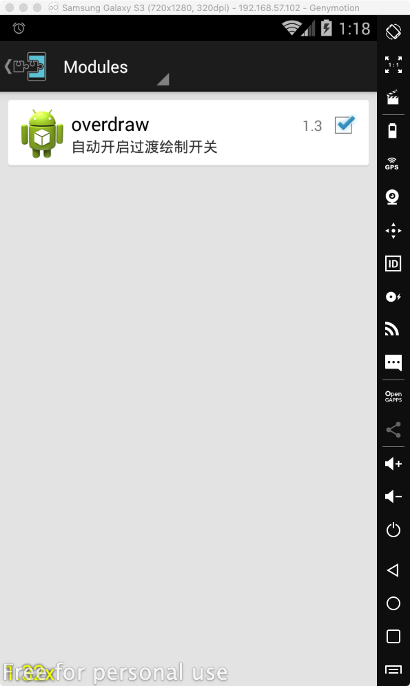

# overdraw-xposedmodule

<p>


</p>

过渡绘制自动化测试Xposed插件



## 切换到count模式
```
adb shell setprop debug.hwui.overdraw count
```

## 切换到show模式
```
adb shell setprop debug.hwui.overdraw show
```

## 查看当前页面的过渡绘制次数
```
adb shell cat /sdcard/overDraw.txt
```